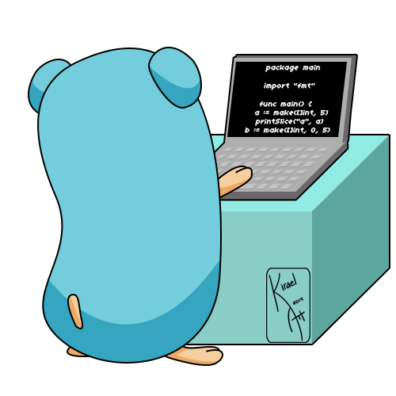

### Hello! I’m Nicolas Collier.

I'm PhD in acoustics who's transitioning into Software Engineering/Full stack developer.  I am working on a start-up creation project at Alacrity France incubator/accelerator. This project consists of developing a software solution for locating illegal RF sources.

I am passionate about web and software development, and I particularly like developing in Go language.

### 👩‍💻 What I use

- 💻 Backend and core software: Go & Python.
- 🔭 Front-end: Node.js, Vue.js, Graphql, MongoDB, MySQL. 
- 🌱 I’m currently learning Machine Learning 🚀.
- 👯 I’m looking to collaborate on any Open Source Project involving Go.
- 💻 I have worked on Python, HTML/CSS, Javascript, Reactjs, Angular, Expressjs, MySQL, MongoDB, Git, Docker.

_Last updated on 15 Aug 2020_.
